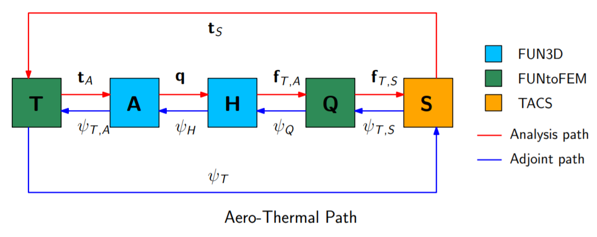
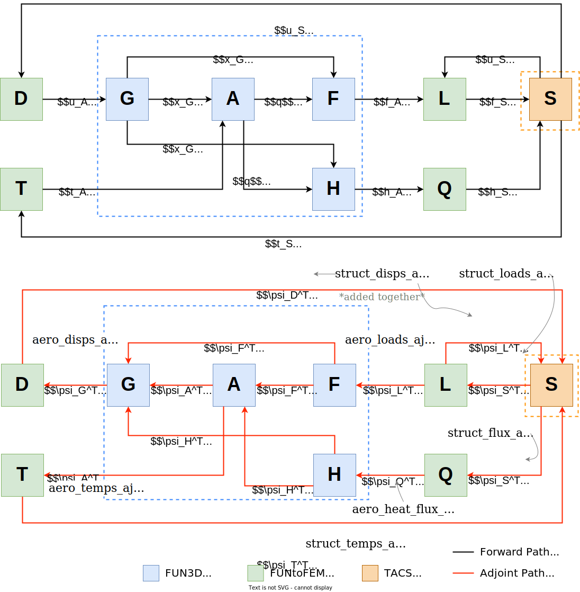

Analysis Framework
*****************************

.. .. automodule:: AnalysisFramework

Terms are color coded in this framework to keep track of the several aspects of the code:

#. :math:`\color{green} \text{Transfer Scheme}`
#. :math:`\color{blue} \text{Fluid Solver}`
#. :math:`\color{orange} \text{Structural Solver}`
#. :math:`\color{red} \text{Shape Parameterization}`

MELD Transfer Scheme
------------------------------------------------
The following residuals are computed in the forward direction for the MELD 
transfer scheme, which transfers displacements, loads, and heat flux.

Displacement Transfer Residual 
==============================
.. math:: 
	\mathbf{\color{green}D}(\mathbf{u}_A, \mathbf{u}_S, \mathbf{x}_A, \mathbf{x}_S) \triangleq 
	\mathbf{u}_A - \xi(\mathbf{u}_S, \mathbf{x}_A, \mathbf{x}_S) = 0

* :math:`\mathbf{u}_A` - displacements of aerodynamic surface nodes
* :math:`\mathbf{u}_S` - displacements of structural nodes
* :math:`\mathbf{x}` - design variable vector (made up of :math:`\mathbf{x}_A` and :math:`\mathbf{x}_S`)
* :math:`\xi` - action of the displacement transfer

Load Transfer Residual 
======================
.. math:: 
	\mathbf{\color{green}L}(\mathbf{f}_A, \mathbf{f}_S, \mathbf{u}_S, \mathbf{x}_A, \mathbf{x}_S)
	\triangleq \mathbf{f}_S - \eta (\mathbf{f}_A, \mathbf{u}_S, \mathbf{x}_A, \mathbf{x}_S) = 0

* :math:`\mathbf{f}_A` - nodal forces on aerodynamic surface
* :math:`\mathbf{f}_S` - nodal forces on structure
* :math:`\mathbf{u}_S` - discplaments of structural nodes
* :math:`\mathbf{x}` - design variable vector (made up of :math:`\mathbf{x}_A` and :math:`\mathbf{x}_S`)
* :math:`\xi` - action of the displacement transfer

Heat Flux Transfer Residual 
===========================
.. math:: 
	\mathbf{\color{green}Q}(\mathbf{h}_A, \mathbf{h}_S) \triangleq \mathbf{h}_S - \mathbf{W}^T \mathbf{h}_A = 0

* :math:`\mathbf{h}_A` - aerodynamic heat flux at the structure surface
* :math:`\mathbf{h}_S` - structure heat flux at the surface
* :math:`\mathbf{W}` - weight matrix for the temperature transfer

Temperature Residual 
====================
.. math:: 
	\mathbf{\color{green}T}(\mathbf{t}_A, \mathbf{t}_S) \triangleq \mathbf{t}_A - \mathbf{W}\mathbf{t}_S = 0

* :math:`\mathbf{t}_A` - aerodynamic temperatures at the structure surface
* :math:`\mathbf{t}_S` - structure temperatures at the surface
* :math:`\mathbf{W}` - weight matrix for the temperature transfer

FUN3D, Flow Solver
---------------------------------------------

Flow Residual
=============
.. math:: 
	\mathbf{\color{blue}A}(\mathbf{q}, t, \mathbf{t}_A, \mathbf{x}, \mathbf{x}_G) \triangleq 
	\frac{\partial (\mathbf{q}V)}{\partial t} + \oint\left(\mathbf{\overline{\overline{F}}}^* - 
	\mathbf{\overline{\overline{F}}}_v  \right) \cdot \mathbf{\hat{n}} \text{dS} = 0

* :math:`\mathbf{q}` - flow state vector
* :math:`t` - time
* :math:`\mathbf{t}_A` - aerodynamic surface mesh temperature
* :math:`\mathbf{x}` - design variable vector
* :math:`\mathbf{x}_G` - aerodynamic volume mesh

Force Integration Residual
==========================
.. math::
	\mathbf{\color{blue}F}(\mathbf{f}_A, \mathbf{q}, \mathbf{x}_G) \triangleq 
	\mathbf{f}_A - \phi(\mathbf{q}, \mathbf{x}_G) = 0

* :math:`\mathbf{f}_A` - nodal forces on aerodynamic surface
* :math:`\mathbf{x}_G` - aerodynamic volume mesh
* :math:`\phi` - action of the force integration

Grid Deformation Residual
=========================
.. math:: 
	\mathbf{\color{blue}G}(\mathbf{u}_A, \mathbf{x}, \mathbf{x}_G) \triangleq 
	( \mathbf{x}_{A0}+\mathbf{u}_A ) - \mathbf{K}_G \mathbf{x}_G = 0

* :math:`\mathbf{u}_A` - displacements of aerodynamic surface nodes
* :math:`\mathbf{x}` - design variable vector
* :math:`\mathbf{x}_{A0}` - initial aerodynamic surface mesh (after shape changes)
* :math:`\mathbf{x}_G` - aerodynamic volume mesh
* :math:`\mathbf{K}_G` - mesh elasticity stiffness matrix based on :math:`\mathbf{ \hat{x} }_G` (constant)

Heat Flux Integration Residual 
==============================
.. math:: 
	\mathbf{\color{blue}H}(\mathbf{h}_A, \mathbf{q}, \mathbf{x}, \mathbf{x}_G) \triangleq
	\mathbf{h}_A - \varphi (\mathbf{q}, \mathbf{x}, \mathbf{x}_G) = 0

* :math:`\mathbf{h}_A` - nodal forces on aerodynamic surface
* :math:`\mathbf{x}` - design variable vector
* :math:`\mathbf{x}_G` - aerodynamic volume mesh
* :math:`\mathbf{q}` - flow state vector
* :math:`\varphi` - action of the heat flux integration

TACS, Structure Solver
---------------------------------------------------
Structural Residual
===================
.. math::
	\mathbf{\color{orange}S}(\mathbf{f}_S, \mathbf{u}_S, \mathbf{\dot{u}}_S, \mathbf{\ddot{u}}_S, \mathbf{x}) \triangleq
	\mathbf{M}\mathbf{\ddot{u}}_S + \mathbf{C}\mathbf{\dot{u}}_S + \mathbf{K}\mathbf{u}_S
	- \mathbf{f}_S = 0

*  :math:`\mathbf{f}_S` - nodal forces on structure
*  :math:`\mathbf{u}_S` - displacements of structural nodes
*  :math:`\mathbf{x}` - design variable vector

Aeroelastic Framework
---------------------
The forward solve path in FUNtoFEM goes through several steps. 
First, the surface displacements are computed inside FUNtoFEM, taking the displacement 
of structural nodes, :math:`\mathbf{u}_S`, as an input and solving for the displacements of
aerodynamic surface nodes, :math:`\mathbf{u}_A`, in the displacement 
transfer residual, :math:`\mathbf{\color{green}D}`.
The grid deformation residual, :math:`\mathbf{\color{blue}G}`, is then 
computed with the displacement of the aerodynamic surface nodes, :math:`\mathbf{u}_A`, 
as an input and solving for :math:`\mathbf{x}_G`, the aerodynamic volume mesh. 
This is then followed by the flow residual, :math:`\mathbf{\color{blue}A}`, 
and the force integration residual, :math:`\mathbf{\color{blue}F}`. 
These three residuals are internal to FUN3D. 
The load transfer residual, :math:`\mathbf{\color{green}L}`, is then solved inside FUNtoFEM.
Finally, the structural residual, :math:`\mathbf{\color{orange}S}`, is computed in TACS.

The order of execution in the forward solve follows the list shown below. 
The underlined value is solved for at each step.

.. math:: 
	\begin{align}
	\mathbf{\color{green}D}(\underline{\mathbf{u}_A}, \mathbf{u}_S) &= 0 \\
	\mathbf{\color{blue}G}(\mathbf{u}_A, \underline{\mathbf{x}_G}) &= 0 \\
	\mathbf{\color{blue}A}(\underline{\mathbf{q}}, \mathbf{x}_G) &= 0 \\
	\mathbf{\color{blue}F}(\underline{\mathbf{f}_A}, \mathbf{q}, \mathbf{x}_G) &= 0 \\
	\mathbf{\color{green}L}(\mathbf{f}_A, \underline{\mathbf{f}_S}, \mathbf{u}_S) &= 0 \\
	\mathbf{\color{orange}S}(\mathbf{f}_S, \underline{\mathbf{u}_S}) &= 0
	\end{align}

Aeroelastic Adjoint
===================
The order of execution in the code follows:

.. math:: 
	\begin{align}
	\frac{\partial \mathbf{L}^T}{\partial \mathbf{f}_S} {\psi_L} + \frac{\partial \mathbf{S}^T}{\partial \mathbf{f}_S}\psi_S &= 0 \\
	\frac{\partial \mathbf{F}^T}{\partial \mathbf{f}_A}\psi_F + \frac{\partial \mathbf{L}^T}{\partial \mathbf{f}_A}\psi_L &= 0 \\
	\frac{\partial \mathbf{A}^T}{\partial \mathbf{q}}\psi_A + \frac{\partial \mathbf{F}^T}{\partial \mathbf{q}}\psi_F &= -\frac{\partial \mathbf{f}^T}{\partial \mathbf{q}} \\
	\frac{\partial \mathbf{G}^T}{\partial \mathbf{x}_G}\psi_G + \frac{\partial \mathbf{A}^T}{\partial \mathbf{x}_G}\psi_A + \frac{\partial \mathbf{F}^T}{\partial \mathbf{x}_G}\psi_F &= -\frac{\partial \mathbf{f}^T}{\partial \mathbf{x}_G} \\
	\frac{\partial \mathbf{D}^T}{\partial \mathbf{u}_A}\psi_D + \frac{\partial \mathbf{G}^T}{\partial \mathbf{u}_A}\psi_G &= 0 \\
	\frac{\partial \mathbf{S}^T}{\partial \mathbf{u}_S}\psi_S + \frac{\partial \mathbf{D}^T}{\partial \mathbf{u}_S}\psi_D + 
	\frac{\partial \mathbf{L}^T}{\partial \mathbf{u}_S}\psi_L &= -\frac{\partial \mathbf{f}^T}{\partial \mathbf{u}_S} \\
	\end{align}

The corresponding Lagrangian in the areoelastic framework is given by:

.. math:: 
	\mathcal{L}(\mathbf{x}, \mathbf{q}, \mathbf{x}_{G}, \mathbf{u}_{A}, \mathbf{f}_{A}, \mathbf{f}_{S}, \mathbf{u}_S) = &
          f(\mathbf{x}, \mathbf{q}, \mathbf{x}_{G}, \mathbf{u}_{A}, \mathbf{f}_{A}, \mathbf{f}_{S}, \mathbf{u}_S)
           +\mathbf{\psi}_{G}^{T} {\mathbf{G}} (\mathbf{x}, \mathbf{u}_{A}, \mathbf{x}_{G} )         \\
          &+\mathbf{\psi}_{A}^{T} {\mathbf{A}} (\mathbf{x}, \mathbf{q}, \mathbf{x}_{G})
           +\mathbf{\psi}_{F}^{T} {\mathbf{F}} (\mathbf{x}, \mathbf{x}_{G}, \mathbf{q}, \mathbf{f}_{A}) \\
          &+\mathbf{\psi}_{L}^{T} {\mathbf{L}} (\mathbf{x}, \mathbf{u}_S, \mathbf{f}_{A}, \mathbf{f}_{S})
           +\mathbf{\psi}_{S}^{T} {\mathbf{S}} (\mathbf{x}, \mathbf{u}_S, \mathbf{f}_{S})             \\
          &+\mathbf{\psi}_{D}^{T} {\mathbf{D}} (\mathbf{x}, \mathbf{u}_S, \mathbf{u}_{A})

Aerothermal Framework
---------------------

The residuals for the aerodynamic governing equations are obtained using a discrete approximation of the following integral over each finite volume

.. math::

	{A}\left({x}, {q}, {\dot{q}}, {x}_G, {\dot{x}}_G, {t}_{A}, t\right) \triangleq \dfrac{\partial \left( V {q} \right)} 
	{\partial t} + \oint_{\partial V} \left( {\overline{\overline{F}}}^* - {\overline{\overline{F}}_v} \right) \cdot { \hat{n}} dS = 0

An interface has been added to FUN3D for aerothermoelastic analysis using the FUNtoFEM framework. 
This interface provides routines for both force and heat flux integration, as well as the terms needed for the adjoint equations. 
Furthermore, the interface adds the required multidisciplinary components to the right-hand-side of the aerodynamic adjoint equations. 
The force integration is a function of the aerodynamic state variables and the node locations and constitutes a system of residuals written as:

.. math::

	{F} \left( {x}, {x}_G, {q}, {f}_A \right) \triangleq {\phi} \left( {x}, {x}_G, {q} \right) - {f}_A = 0

The heat flux integration is also a function of the aerodynamic state variables and node locations and is written as

.. math::

	{H} \left( {x}, {x}_G, {q}, {f}_{T,A} \right) \triangleq {\varphi} \left( {x}, {x}_G, {q} \right) - {f}_{T,A} = 0

Aerothermal Adjoint
===================

The Lagrangian for the aerothermal problem is formed by summing the function of interest with the products of the 
residuals for each analysis component combined with their corresponding adjoint, giving the following expression:

.. math::

	\mathbf{\mathcal{L}}_{AT} \triangleq \; & f(\mathbf{x},\mathbf{q},\mathbf{t}_{A},\mathbf{f}_{T,A},\mathbf{f}_{T,S},\mathbf{t}_{S})
    + \mathbf{\psi}_{A}^{T} \mathbf{A}(\mathbf{x},\mathbf{q},{t}_{A})
    + \mathbf{\psi}_{H}^{T} \mathbf{H}(\mathbf{x},\mathbf{t}_{A},\mathbf{q},\mathbf{f}_{T,A})
    + \mathbf{\psi}_{Q}^{T} \mathbf{Q}(\mathbf{f}_{T,A},\mathbf{f}_{T,S})\\
    & + \mathbf{\psi}_{T,S}^{T} \mathbf{S}(\mathbf{x},\mathbf{t}_{S},\mathbf{f}_{T,S})
    + \mathbf{\psi}_{T}^{T} \mathbf{T}(\mathbf{t}_{S},{t}_{A})

The adjoint equations are obtained by taking the derivative of the Lagrangian with respect to the state variables and 
setting it to zero. This results in the following coupled system of equations:

.. math::

	\begin{bmatrix}
	\frac{\partial \mathbf{A}}{\partial \mathbf{q}}^{T} &
	\frac{\partial \mathbf{H}}{\partial \mathbf{q}}^{T} & 0 & 0 & 0\\
	%
	0 & \frac{\partial \mathbf{H}}{\partial \mathbf{f}_{T,A}}^{T} &
	\frac{\partial \mathbf{Q}}{\partial \mathbf{f}_{T,A}}^{T} & 0 & 0 \\
	%
	0 & 0 & \frac{\partial \mathbf{Q}}{\partial \mathbf{f}_{T,S}}^{T} &
	\frac{\partial \mathbf{S}}{\partial \mathbf{f}_{T,S}}^{T} & 0 \\
	%
	0 & 0 & 0 & \frac{\partial \mathbf{S}}{\partial \mathbf{t}_{S}}^{T} & 
	\frac{\partial \mathbf{T}}{\partial \mathbf{t}_{S}}^{T} \\
	%
	\frac{\partial \mathbf{A}}{\partial \mathbf{t}_{A}}^{T} & 0 & 0 & 0 &
	\frac{\partial \mathbf{T}}{\partial \mathbf{t}_{A}}^{T} \\
	%
	\end{bmatrix} 
	\begin{bmatrix}
	\mathbf{\psi}_{A} \\
	\mathbf{\psi}_{H} \\
	\mathbf{\psi}_{Q} \\
	\mathbf{\psi}_{T,S} \\
	\mathbf{\psi}_{T}
	\end{bmatrix} 
	= -
	\begin{bmatrix}
	\frac{\partial f}{\partial \mathbf{q}}^{T} \\
	\frac{\partial f}{\partial \mathbf{f}_{T,A}}^{T} \\
	\frac{\partial f}{\partial \mathbf{f}_{T,S}}^{T} \\
	\frac{\partial f}{\partial \mathbf{t}_{S}}^{T} \\
	\frac{\partial f}{\partial \mathbf{t}_{A}}^{T} \\
	\end{bmatrix} 

	

Aerothermoelastic Framework
---------------------------

.. |*| replace:: :math:`\times`

The surface displacements are computed by solving the displacement transfer residuals and preserving rigid-body motion. The displacement transfer scheme is given by:

.. math::

	{D}({x}, {u}_{S}, {u}_{A}) \triangleq {\xi}({x}, {u}_{S}) - {u}_{A} = 0

To obtain a consistent and conservative load transfer, the load transfer is derived based on the method of virtual work. The residual of the load transfer scheme is:

.. math::

	{L}({x}, {u}_{S}, {f}_{A}, {f}_{S}) \triangleq {\eta}({x}, {u}_{S}, {f}_{A}) - {f}_{S} = 0

MELDThermal links each aerodynamic surface node, where a wall temperature will be specified, to a fixed number of the nearest 
structural nodes from which the structural temperature will be interpolated. 
This approach is analogous to the localization property of MELD such that each aerodynamic surface node receives temperature 
information from a limited number of structural nodes. The temperature of the aerodynamic surface node is then computed from the 
temperatures of the set of linked structural nodes:

.. math::

	T_{A} = \sum_{i=1}^{N} w_{i} {T_{S}}_{i}

The weights are computed based on the Euclidean distance between the aerodynamic node and the corresponding structural surface nodes:

.. math::

	w_{i} = e^{- \beta d_{i}^2}  \Bigg/ \sum_{j=1}^{N} e^{- \beta d_{j}^2}

The interpolation is repeated for all aerodynamic surface nodes, giving the temperature transfer residual:

.. math::

	{T}({t}_{S}, {t}_{A}) \triangleq  {W} {t}_{S} - {t}_{A} = 0,

The relationship between the area-weighted heat flux at the aerodynamic surface nodes and the resulting heat flux on the 
structural nodes is calculated in the same manner as the loads. Based on virtual work, the flux produced at a structural 
node by the force at an aerodynamic surface node is:

.. math::

	{Q}({f}_{T,A}, {f}_{T,S}) \triangleq {W}^{T} {f}_{T,A} - {f}_{T,S} = 0

.. table:: Body Class Members

    =============== =================   =================== ===========
    Symbol          Variable Name       Size                Role
    =============== =================   =================== ===========
    :math:`u_A`     aero_disps          3 |*| aero_nnodes   FUN3D input
    :math:`t_A`     aero_temps          aero_nnodes         FUN3D input
    :math:`f_A`     aero_loads          3 |*| aero_nnodes   FUN3D output
    :math:`h_A`     aero_flux           aero_nnodes         FUN3D output
    :math:`f_S`     struct_loads        3 |*| struct_nnodes TACS input
    :math:`h_S`     struct_flux         struct_nnodes       TACS input
    :math:`u_S`     struct_disps        3 |*| struct_nnodes TACS output
    :math:`t_S`     struct_temps        struct_nnodes       TACS output
    =============== =================   =================== ===========

The body class members listed above use accessors to get them. aero_nnodes refers to the number
of nodes on the aerodynamic surface mesh. Similarly, struct_nnodes refers to the number of nodes
on the structural mesh. Where the size is indicated as 3 |*| nnodes, the vector is structured as concatenated
trios of (x, y, z) values.

Aerothermoelastic Adjoint
=========================

The aerothermoelastic adjoint equations are derived to be discretely consistent with the forward governing equations. 
The Lagrangian for the aerothermoelastic problem is formed by summing the function of interest with the products of the residuals 
for each analysis component combined with their corresponding adjoint, giving the following expression:

.. math::

	\mathbf{\mathcal{L}}_{ATE} \triangleq \; & f({x}, {q}, {x}_{G}, {f}_{A}, {f}_{S}, {f}_{T,A}, {f}_{T,S}, {u}_{S}, {t}_{S}, {u}_{A}, {t}_{A})
    + \psi_{A}^{T} {A}({x}, {q}, {x}_G, {t}_{A} )
    + \psi_{G}^{T} {G}\left({x}, {u}_{A}, {x}_G\right) \\
    & + \psi_{F}^{T} {F} ( {x}, {x}_G, {q}, {f}_A )
    + \psi_{L}^{T} {L}({x}, {u}_{S}, {f}_{A}, {f}_{S})
    + \psi_{H}^{T} {H} \left( {x}, {x}_G, {q}, {f}_{T,A} \right) 
    + \psi_{Q}^{T} \mathbf{Q}(\mathbf{f}_{T,A},\mathbf{f}_{T,S}) \\
    & + \psi_{S}^{T} \mathbf{S}(\mathbf{x},{u}_{S},\mathbf{t}_{S},{f}_{S},\mathbf{f}_{T,S})
    + \psi_{D}^{T} {D}({x}, {u}_{S}, {u}_{A})
    + \psi_{T}^{T} \mathbf{T}(\mathbf{t}_{S},{t}_{A})

The adjoint equations are obtained by taking the derivative of the aerothermoelastic Lagrangian with respect to the state 
variables and setting it to zero. This results in the following coupled system of equations:

.. math::

	\begin{bmatrix}
	\frac{\partial \mathbf{A}}{\partial \mathbf{q}}^{T} & 0 &
	\frac{\partial {F}}{\partial {q}}^{T} & 0 &
	\frac{\partial \mathbf{H}}{\partial \mathbf{q}}^{T} & 0 & 0 & 0 & 0 \\
	%
	\frac{\partial {A}}{\partial {x}_{G}}^{T} & 
	\frac{\partial {G}}{\partial {x}_{G}}^{T} &
	\frac{\partial {F}}{\partial {x}_{G}}^{T} & 0 &
	\frac{\partial {H}}{\partial {x}_{G}}^{T} & 0 & 0 & 0 & 0 \\
	%
	0 & 0 & \frac{\partial {F}}{\partial {f}_{A}}^{T} &
	\frac{\partial {L}}{\partial {f}_{A}}^{T} & 0 & 0 & 0 & 0 & 0 \\
	%
	0 & 0 & 0 & \frac{\partial {L}}{\partial {f}_{S}}^{T} &
	0 & 0 & \frac{\partial {S}}{\partial {f}_{S}}^{T} & 0 & 0 \\
	%
	0 & 0 & 0 & 0 & \frac{\partial {H}}{\partial {f}_{T,A}}^{T} &
	\frac{\partial {Q}}{\partial {f}_{T,A}}^{T} & 0 & 0 & 0 \\
	%
	0 & 0 & 0 & 0 & 0 & \frac{\partial {Q}}{\partial {f}_{T,S}}^{T} & 
	\frac{\partial {S}}{\partial {f}_{T,S}}^{T} & 0 & 0 \\
	%
	0 & 0 & 0 & 0 & 0 & 0 &
	\frac{\partial {S}}{\partial {u}_{S}}^{T} &
	\frac{\partial {D}}{\partial {u}_{S}}^{T} &
	\frac{\partial {S}}{\partial {t}_{S}}^{T} \\
	%
	0 & \frac{\partial {G}}{\partial {u}_{A}}^{T} & 0 & 0 & 0 & 0 & 0 &
	\frac{\partial {D}}{\partial {u}_{A}}^{T} & 0 \\
	%
	\frac{\partial {A}}{\partial {t}_{A}}^{T} & 0 & 0 & 0 & 0 & 0 & 0 & 0 &
	\frac{\partial {T}}{\partial {t}_{A}}^{T} 
	\end{bmatrix} 
	\begin{bmatrix}
	\psi_{A} \\
	\psi_{G} \\
	\psi_{F} \\
	\psi_{L} \\
	\psi_{H} \\
	\psi_{Q} \\
	\psi_{S} \\
	\psi_{D} \\
	\psi_{T} \\
	\end{bmatrix} 
	= -
	\begin{bmatrix}
	\frac{\partial f}{\partial \mathbf{q}}^{T} \\
	\frac{\partial f}{\partial {x}_{G}}^{T} \\
	\frac{\partial f}{\partial {f}_{A}}^{T} \\
	\frac{\partial f}{\partial {f}_{S}}^{T} \\
	\frac{\partial f}{\partial {f}_{T,A}}^{T} \\
	\frac{\partial f}{\partial {f}_{T,S}}^{T} \\
	\frac{\partial f}{\partial {u}} \\
	\frac{\partial f}{\partial {u}_{A}} \\
	\frac{\partial f}{\partial {t}_{A}}
	\end{bmatrix} 

Once the solution for the adjoint equations has been obtained, the total derivative for the function of 
interest is computed as the derivative of the Lagrangian.

.. math::

	\nabla_{{x}}f \triangleq \frac{\partial \mathcal{L}_{ATE}}{\partial {x}}

The abbreviation "AJP" is used for the "Adjoint-Jacobian Product." The names of the AJP variables correspond to the
off-diagonal terms of the partial derivative of the Lagrangian with respect to the variable in the forward path with the same name.
The number of functions is abbreviated as nfuncs for a given scenario.

.. |ad_ajp| replace:: :math:`\psi_G^T \frac{\partial G}{\partial u_A}`
.. |at_ajp| replace:: :math:`\psi_A^T \frac{\partial A}{\partial t_A}`
.. |al_ajp| replace:: :math:`\psi_L^T \frac{\partial L}{\partial f_A}`
.. |af_ajp| replace:: :math:`\psi_Q^T \frac{\partial Q}{\partial h_A}`

.. |sd_ajp| replace:: :math:`\psi_D^T \frac{\partial D}{\partial u_S} + \psi_L^T \frac{\partial L}{\partial u_S}`
.. |st_ajp| replace:: :math:`\psi_T^T \frac{\partial T}{\partial t_S}`
.. |sl_ajp| replace:: :math:`\psi_S^T \frac{\partial S}{\partial f_S}`
.. |sf_ajp| replace:: :math:`\psi_S^T \frac{\partial S}{\partial h_S}`

.. table:: Adjoint-Jacobian Products

    ================== ====================   ================================= ===========
    Expression         Variable Name          Size                              Role
    ================== ====================   ================================= ===========
    |ad_ajp|           aero_disps_ajp         3 |*| aero_nnodes |*| nfuncs      FUN3D output
    |at_ajp|           aero_temps_ajp         aero_nnodes |*| nfuncs            FUN3D output
    |al_ajp|           aero_loads_ajp         3 |*| aero_nnodes |*| nfuncs      FUN3D input
    |af_ajp|           aero_flux_ajp          aero_nnodes |*| nfuncs            FUN3D input
    |sl_ajp|           struct_loads_ajp       3 |*| struct_nnodes |*| nfuncs    TACS output
    |sf_ajp|           struct_flux_ajp        struct_nnodes |*| nfuncs          TACS output
    |sd_ajp|           struct_disps_ajp       3 |*| struct_nnodes |*| nfuncs    TACS input
    |st_ajp|           struct_temps_ajp       struct_nnodes |*| nfuncs          TACS input
    ================== ====================   ================================= ===========