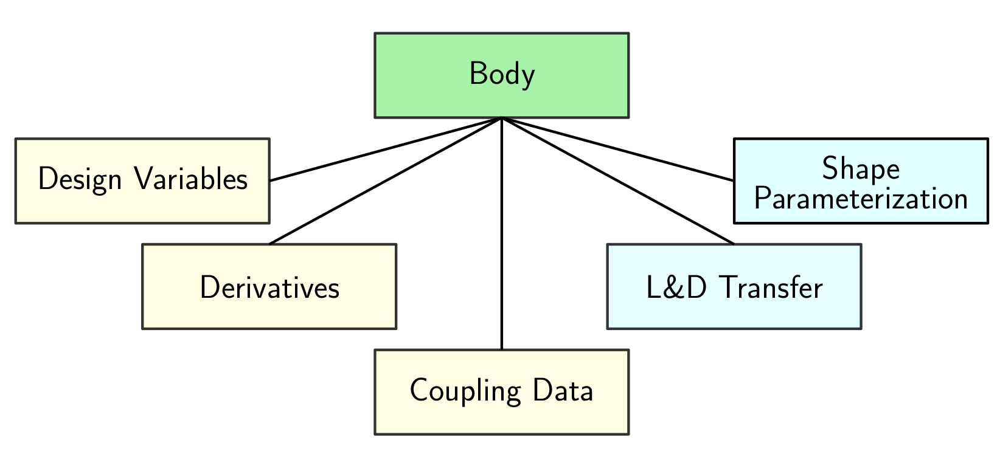

FUNtoFEM Model
**************
The model classes are used to stored design and coupling data related to the aeroelastic problem.
The model is made up of `bodies and scenarios`_ .

.. figure:: images/funtofem_model.png

The bodies are the different bodies in the simulations, such as the blades of a rotor.
The scenarios are the different points of a multipoint optimization.

Methods on this page with **[driver call]** and **[model call]** are calls that the user does not make directly and can be ignored.

Assembling the model
--------------------
A model is assembled using the :func:`~funtofem_model.FUNtoFEMmodel.add_body` and 
:func:`~funtofem_model.FUNtoFEMmodel.add_scenario` calls. See `bodies and scenarios`_ for details about their creation.

The bodies and scenarios are kept in lists in the same order that they are input.

Exchanging the model data with an optimizer
-------------------------------------------
The model object provides a convenient way to exchange data with a python-based optimizer.

Design variables
================
The assembled model contains all the design variables information that an optimizer such as PyOpt needs.
A list of the active design for the entire model is returned by :func:`~funtofem_model.FUNtoFEMmodel.get_variables`.
The output list contains the :class:`variable` type. Here is an example of passing the 
variable information from the model to a PyOpt optimizer:

**The variables are stored in the model as a dictionary.**
**They return in of ordered list of scenarios in the order they were added to the model, 
then the bodies in the order that they were added. Within each scenario and body, 
the order is alphabetical by variable type. Within each variable type, the variables are 
in the order added to the body/scenario.**

.. code-block:: python

   from pyOpt import Optimization
   import numpy as np

   opt_prob = Optimization('optimization',design_problem.eval_obj_con)
   variables = model.get_variables()

   for i,var in enumerate(variables):
       opt_prob.addVar(var.name,type='c',value=var.value/var.scaling,
                                         lower=var.lower/var.scaling,
                                         upper=var.upper/var.scaling)

Optimizers such as PyOpt will typically provide a list of new values at each design point. 
These can be set back into model type using :func:`~funtofem_model.FUNtoFEMmodel.set_variables`.
The variables can be pre-scaled and passed directing into this call, or with the scale argument set to 
True, the scaling will be done automatically.

Function values
===============
Once the driver has been run, :func:`~funtofem_driver.FUNtoFEMDriver.solve_forward`, the functions can be 
retrieved using :func:`~funtofem_model.FUNtoFEMmodel.get_functions`.
The output list contains the :class:`function` type. The following code prints the function values:

.. code-block:: python

   driver.solve_forward()
   functions = model.get_functions()

   print "Function values:"
   for function in enumerate(variables):
       print function.name, '=', function.value

The functions in the FUNtoFEM model need to be single discipline functions to maintain modularity. 
The following pseudo code lays out a function that can be used as an objective evaluation with PyObj:

.. code-block:: python

   def eval_obj_con(x)

       fail = 0
       model.set_variables(x,scale=True)
       fail = driver.solve_forward()
       functions = model.get_functions()

       # Manipulate/scale/combine single discipline functions
       obj = XXXXX
       con[:] = YYYYY

       return obj, con, fail

Gradients
=========

The derivatives in the model class are populated by :func:`~funtofem_driver.FUNtoFEMDriver.solve_adjoint`. 
Gradients can be retrieved using :func:`~funtofem_model.FUNtoFEMmodel.get_function_gradients`.

.. code-block:: python

       variables = model.get_variables()

       driver.solve_forward()
       functions = model.get_functions()

       fail = driver.solve_adjoint()
       grad = model.get_functions_gradients()
       for ifunc,func in enumerate(functions):
                  for ivar,var in enumerate(variables):
                      print 'Derivative of ', func.name, 'w.r.t.', var.name,'=', grad[ifunc][ivar]

The following is a pseudo code would be a gradient evaluation for pyOpt.

.. code-block:: python

   def eval_obj_con_grad(x,obj,con)

       fail = 0

       # get the scaling values
       variables = model.get_variables()
       var_scale = []
       for var in variables:
           var_scaling.append(var.scale)

       # solve the adjoint problem
       fail = driver.solve_adjoint()
       grad = model.get_functions_gradients()

       # use the chain / automatic differentiation to get the composite function derivatives
       g = dobj/dfunc0 * grad[0][:] *variable_scaling + dobj/dfunc1 * grad[1][:] * variable_scaling + ...
       A = YYYYY

       return g, A, fail

FUNtoFEM Model Class
====================

.. currentmodule:: pyfuntofem.funtofem_model

.. autoclass:: FUNtoFEMmodel
    :members:

Bodies and Scenarios
--------------------

Bodies and scenarios organize the data associated for the coupling and design.
Additionally, the body class holds the shape parameterization and transfer scheme.
Shape parameterization is added by creating a new body class that subclasses the :class:`body` class. 
See :class:`~massoud_body.MassoudBody` for an example.
The driver adds the details for the transfer scheme. See :class:`~funtofem_driver.FUNtoFEMDriver`.

Scenarios
=========
Scenarios hold `variables`_ and `functions`_ in lists.
Variables and functions are added using :func:`~scenario.Scenario.add_function` and :func:`~scenario.Scenario.add_variable`.

An example of a scenario variable could be flow variables such as angle of attack or Mach number.

.. figure:: images/scenario.png

.. currentmodule:: pyfuntofem.scenario

.. autoclass:: Scenario
   :members:

Bodies
======
Shape parameterization is added by creating a new body class that subclasses the :class:`body` class. 
See :class:`~massoud_body.MassoudBody` for an example.
The driver adds the details for the transfer scheme. See :class:`~funtofem_driver.FUNtoFEMDriver`.

The aero_loads array is of size 3 x aero_nnodes.

.. currentmodule:: pyfuntofem.body

.. autoclass:: Body
   :members:

.. csv-table:: **Body Member List**
   :header: "Name", "Default Value","Description"
   :widths: 20, 20, 20
   :align: center

   "self.name", "Required Input", "Name"
   "self.analysis_type", "Required Input", "Analysis type (aeroelastic, aerothermal, aerothermoelastic)"
   "self.id", "Required Input", "ID"
   "self.group", "Required Input", "Group categorization"
   "self.group_master", "False", "Top-level body group"
   "self.boundary", 0.0, "Body boundary"
   "self.motion_type", "deform", "Motion type"
   "self.variables", "{}", "Owned variables"
   "self.derivatives", "{}", "Owned derivatives"
   "self.parent", "None", "Body parent"
   "self.children", "[]", "Owned bodies"
   "self.shape", "None", "Shape"
   "self.parameterization", 1.0, "Geometry type"
   "self.transfer", "None", "Transfer method"
   "self.thermal_transfer", "None", "Thermal transfer method"
   "self.struct_nnodes", "None", "Number of structural nodes"
   "self.aero_nnodes", "None", "Number of aerodynamic nodes"
   "self.xfer_ndof", 3.0, "Variable degree of freedom"
   "self.therm_xfer_ndof", 1.0, "Thermal variable degree of freedom"
   "self.T_ref", 300, "Reference temperature"
   "self.struct_X", "None", "Structural variables"
   "self.aero_X", "None", "Aerodynamic variables"
   "self.struct_id", "None", "Structural ID"
   "self.aero_id", "None", "Aerodynamic ID"
   "self.struct_disps", "None", "Structural displacements"
   "self.struct_forces", "None", "Structural forces"
   "self.struct_loads", "None", "Structural loads"
   "self.rigid_transform", "None", "Body transformation scheme"
   "self.aero_disps", "None", "Aerodynamic displacements"
   "self.aero_forces", "None", "Aerodynamic forces"
   "self.aero_loads", "None", "Aerodynamic loads"
   "self.struct_temps", "None", "Structural temperature"
   "self.struct_heat_flux", "None", "Structural heat flux"
   "self.aero_temps", "None", "Aerodynamic temperature"
   "self.aero_heat_flux", "None", "Aerodynamic heat flux"

Base class
==========
The body and scenario classes subclass the `base class`_.

Although most of the methods in the base class are used internally in the model, :func:`~base.Base.set_variable` 
allows the user to change attributes of existing `variables`_ in the body or scenario.
For example, if the shape parameterization created a specific number of variables, but you do not want to use all 
of them in the optimization, you can set the variable to be inactive.

.. currentmodule:: pyfuntofem.base

.. autoclass:: Base
   :members:

MassoudBody
===========
.. .. automodule:: massoud_body

.. .. autoclass:: MassoudBody
   :members:

Variables
=========
Some solvers like FUN3D require some design variables to be defined, whether or not it is being used in design.
The active attribute of the :class:`~variable.Variable` class. Setting it to False, allows you to still define 
the variable but it won't be returned when calling :func:`~funtofem_model.FUNtoFEMmodel.get_variables`.
When the variable is added to a :class:`~scenario.Scenario` or :class:`~body.Body` using :func:`~base.Base.add_variable`, 
the vartype argument specifies what discipline the variable is associated with.

.. currentmodule:: pyfuntofem.variable

.. autoclass:: Variable
   :members:

Functions
=========
Functions in the FUNtoFEM framework are single discipline functions.
The *analysis_type* argument specifics which discipline the function is associated with.
Currently the options are 'aerodynamic' and 'structural'.

Once the function is instantiated, :class:`~scenario.Scenario.add_function` is used to add it to a scenario.
Although the function values could be accessed from the model type, :func:`~funtofem_model.FUNtoFEMmodel.get_functions` 
will return all the `functions`_ defined in the model.

When FUNtoFEM is used with FUN3D, the name of any function that would be defined in the rubber.data can be used.
For functions that do not need an adjoint, such as structural mass, the boolean, adjoint, should be set to false.
Some functions are associated with particular bodies, for instance, if you wanted the thrust or torque of a rotor 
without including that of the sting model, you can use the body argument to pass that information to the solver.

.. currentmodule:: pyfuntofem.function

.. autoclass:: Function
   :members:

