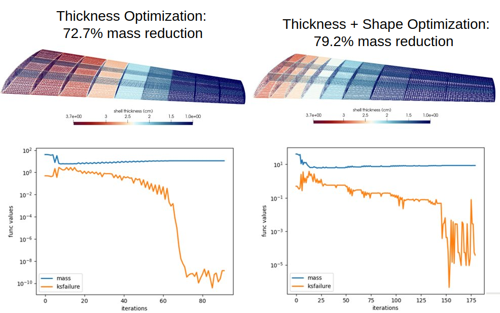

# FUNtoFEM Framework Examples #

* `functionality` - Simple demonstrations of building `Body`, `Function`, `FUNtoFEMmodel` classes, etc.
* `piston_theory` - Run an aeroelastic analysis using the `PistonInterface` class for a simplified aerodynamic solver. Is helpful in aeroelastic unittests.
* `tacs_oneway_naca_wing` - Optimization of a NACA-0012 wing under fixed aerodynamic loads with the `TacsOnewayDriver`. First a sizing optimization is performed to set panel thicknesses. Then a combined sizing-shape optimization is performed to also determine the best placement of ribs and spars. ESP/CAPS is used to facilitate rib and spar motion.

### TACS Oneway NACA Wing Example ###
<i>Directory</i> - `tacs_oneway_naca_wing`
<figure class="image">
  
  <figcaption><em>Optimization results from the tacs oneway-coupled driver of the NACA wing.</em></figcaption>
</figure>