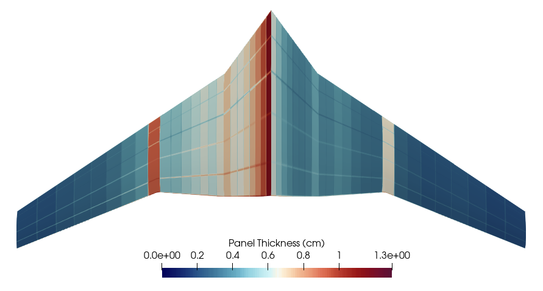
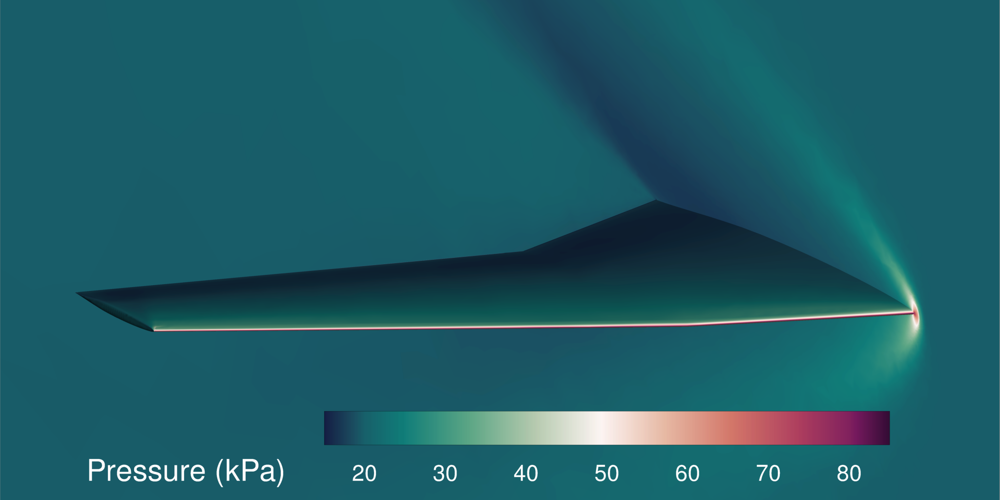

# FUN3D Examples

Examples are organized by geometry group. Each group collects all FUN3D-based examples for a single aircraft or wing geometry.

---

## Super Simple Wing (SSW)

The SSW is a simple rectangular wing geometry used for aeroelastic and aerothermal optimization studies.

- **`ssw/aeroelastic_optimization/`** — Inviscid aeroelastic optimization of the Super Simple Wing. Uses FUN3D, TACS, and CAPS/ESP. Scripts 1–4 cover panel thickness optimization, shape optimization, and derivative testing.

- **`ssw/ssw_meshdef_optimization/`** — Mesh deformation-based aeroelastic optimization of the Super Simple Wing. Uses FUN3D, TACS, and CAPS/ESP.

- **`ssw/ssw_remesh_optimization/`** — Remesh-based aeroelastic optimization of the Super Simple Wing. Uses FUN3D, TACS, and CAPS/ESP.

---

## Supersonic Transport Wing (SST)

The SST is a realistic supersonic aircraft wing geometry used for aerothermoelastic optimization.

The SST results images and README live directly in `sst/`. See `sst/sst_optimization/` for the complete runnable example.

```
Engelstad, S. P., Burke, B. J., Patel, R. N., Sahu, S., and Kennedy, G. J.,
"High-Fidelity Aerothermoelastic Optimization with Differentiable CAD Geometry,"
AIAA Scitech 2023 Forum, National Harbor, MD, 2023. doi:10.2514/6.2023-0329.
```

<figure class="image">
  
  <figcaption><em>Optimal thicknesses for the supersonic transport wing.</em></figcaption>
</figure>
<br>
<figure class="image">
  
  <figcaption><em>Pressure contours in the Mach 2.0 flow solved in FUN3D.</em></figcaption>
</figure>

### `sst/sst_optimization/`

Complete multi-step aerothermoelastic optimization example adapted from the research case. Includes mesh generation, sizing optimization, shape optimization, and fully coupled optimization scripts. Uses FUN3D, TACS, and CAPS/ESP.

```
Engelstad, S. P., Burke, B. J., Patel, R. N., Sahu, S., and Kennedy, G. J.,
"High-Fidelity Aerothermoelastic Optimization with Differentiable CAD Geometry,"
AIAA Scitech 2023 Forum, National Harbor, MD, 2023. doi:10.2514/6.2023-0329.
```

---

## Diamond

- **`diamond/wedge_optimization/`** — Steady aerothermoelastic optimization of a supersonic diamond wedge panel. Minimizes average structural temperature subject to a mass constraint using a fully coupled FUN3D + TACS analysis. Uses a hand-built hexahedral BDF mesh (no CAPS/ESP required).

---

## Archive

The `archive/` subdirectory preserves older examples that are no longer actively maintained. These examples are kept for historical reference but should not be used as templates for new work.

- **`archive/ate_wedge_optimization/`** — Original version using deprecated APIs (`MassoudBody`, old `FUNtoFEMnlbgs` constructor, `PyOptOptimization`). Updated version is at `diamond/wedge_optimization/`.

- **`archive/pyopt_togw_optimization/`** — Archived because it uses deprecated APIs (`MassoudBody`, `PyOptOptimization`). Original reference:

  ```
  Jacobson, K., Kiviaho, J., Smith, M., and Kennedy, G., "An Aeroelastic Coupling Framework for Time-accurate Analysis and Optimization," 2018 AIAA/ASCE/AHS/ASC Structures, Structural Dynamics, and Materials Conference, 2018. doi:10.2514/6.2018-0100.
  ```

- **`archive/diamond_unsteady/`** — Archived because it is incomplete (no mesh files included).

- **`archive/sst_unsteady/`** — Archived because it is incomplete (no mesh files included).
