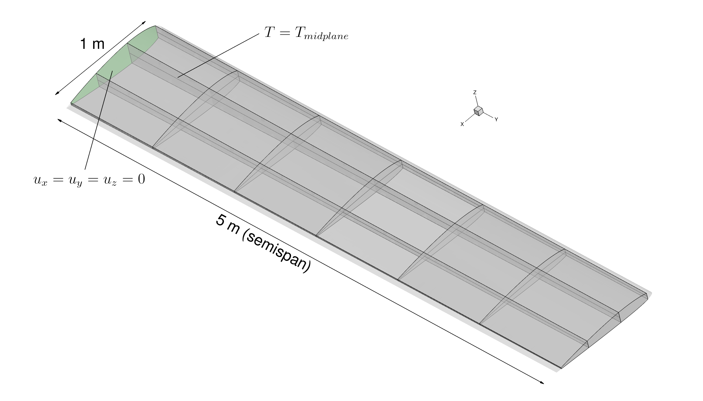

# Super Simple Wing (SSW)

The Super Simple Wing is a rectangular wing geometry used to demonstrate and test fully coupled aeroelastic optimization with FUN3D, TACS, and ESP/CAPS. Its simple shape makes it easy to reason about the design variables and expected optimization behavior, while still exercising the full FUNtoFEM coupling framework.

## Flight Conditions

All SSW examples use a steady cruise at FL 100 (~3000 m). From the 1976 Standard Atmosphere:

| Parameter | Value |
|-----------|-------|
| T∞ | 268.338 K |
| p∞ | 69.68 kPa |
| ρ∞ | 0.9046 kg/m³ |
| μ∞ | 1.7115×10⁻⁵ Pa·s |
| Mach | 0.5 (164.19 m/s) |
| q∞ | 12.1945 kPa |
| Re_L | 8.776×10⁶ |
| AoA | 2° |

## Dependencies

- FUN3D
- TACS
- ESP/CAPS (pyCAPS)
- mpi4py
- pyoptsparse (SNOPT)

## Examples

### [`aeroelastic_optimization/`](aeroelastic_optimization/)

Inviscid aeroelastic optimization using the remeshing-based shape driver. Geometry shape variables are updated via ESP/CAPS and the CFD mesh is regenerated at each major iteration.

**Design variables**: panel thicknesses, angle of attack, geometric twist at each span station, OML airfoil thickness

**Scripts**:
- `_run_flow.py` — one-way aero forward analysis to produce an aero loads file
- `_oneway_sizing.py` — one-way structural sizing optimization using the aero loads file
- `1_panel_thickness.py` — fully coupled panel thickness optimization (no shape)
- `2_aero_aoa.py` — fully coupled AoA optimization
- `3_geom_twist.py` — fully coupled geometric twist shape optimization
- `4_oml_shape.py` — fully coupled twist + OML airfoil thickness optimization

---

### [`ssw_meshdef_optimization/`](ssw_meshdef_optimization/)

Aeroelastic optimization using mesh deformation (no remeshing). Shape changes are applied by deforming the existing CFD mesh, which is faster per iteration but limited to smaller shape perturbations.

**Design variables**: panel thicknesses, angle of attack, geometric twist, OML airfoil thickness

**Scripts**:
- `_run_flow.py` — one-way aero forward analysis
- `_oneway_sizing.py` — one-way structural sizing
- `1_panel_thickness.py` — fully coupled panel thickness optimization
- `2_aero_aoa.py` — fully coupled AoA optimization
- `3_geom_twist.py` — fully coupled geometric twist optimization
- `4_oml_shape.py` — fully coupled twist + OML thickness optimization
