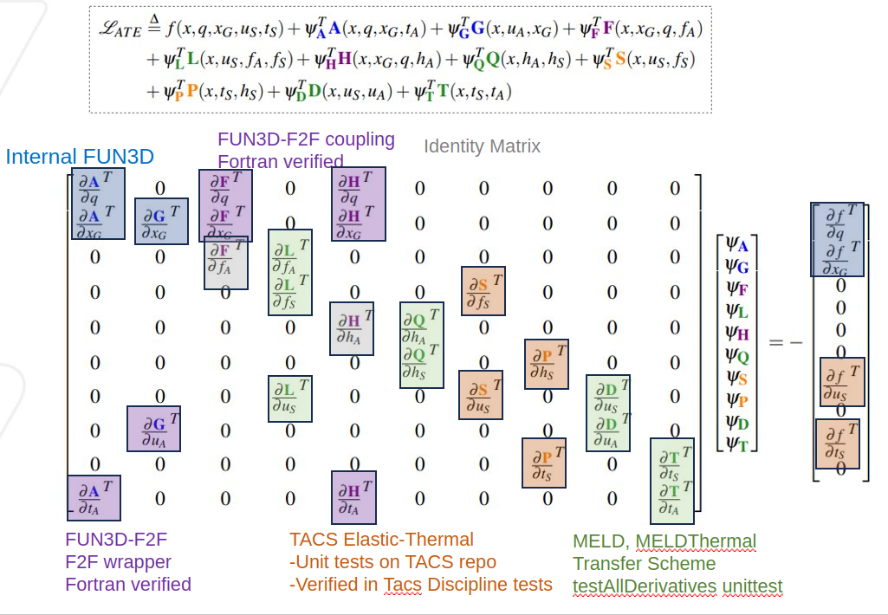
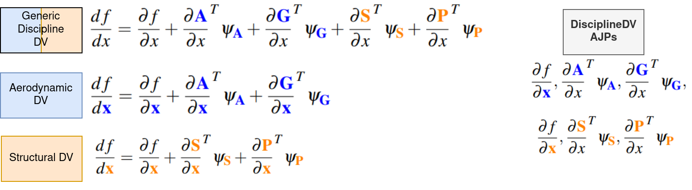
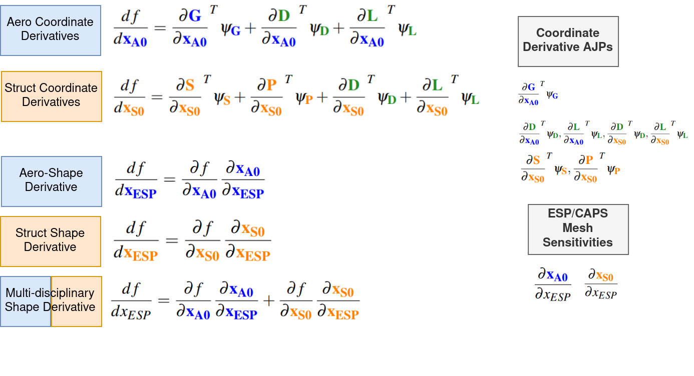
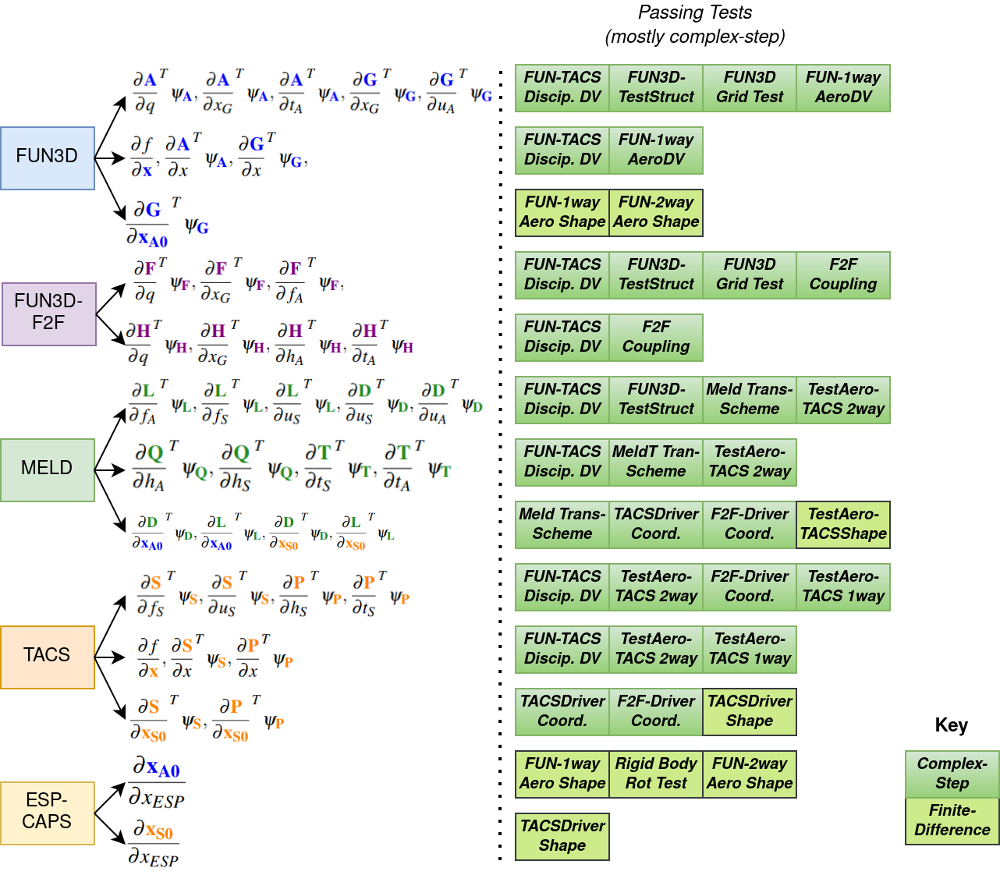

# FUNtoFEM Tests #
Github workflow tests are included in the `unit_tests` folder. More comprehensive FUN3D tests are located in the `fun3d_tests` directory. The adjoint equations, total derivatives, shape derivatives, and verification matrix for FUN3D-TACS coupling are provided below. Adjoint equations for alternative solvers may be provided in the future.

### Adjoint Equations ###
<figure class="image">
  
</figure>

### Discipline Total Derivatives ###
<figure class="image">
  
</figure>

### Shape Derivatives ###
<figure class="image">
  
</figure>

### Adjoint-Jacobian Product Verification Matrix ###
<figure class="image">
  
</figure>