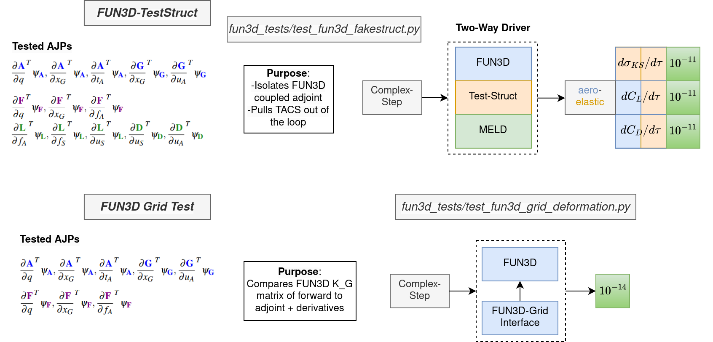
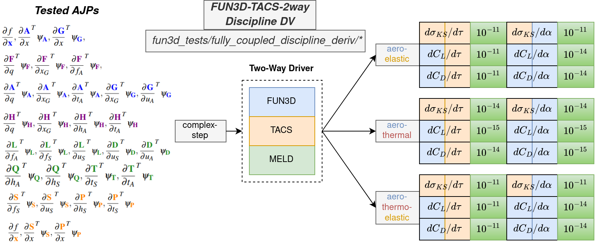
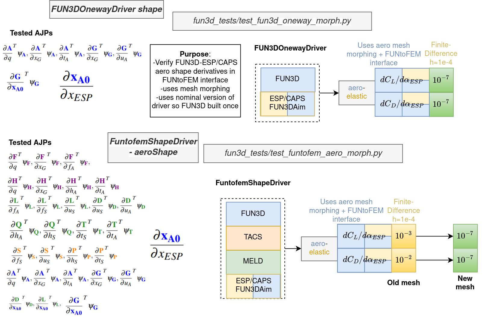

# FUN3D Tests #

* `fully_coupled_disc_deriv/` - Compare the complex-step and adjoint derivatives for `structural` and `aerodynamic` discipline design variables in steady-state, fully-coupled FUN3D-TACS analysis, with the `FuntofemNlbgs` driver. The test is repeated for <i>laminar, viscous</i> FUN3D flow, and <i>aeroelastic, aerothermal, aerothermoelastic</i> couplings.
* `fully_coupled_remesh/` - Compare the finite difference and adjoint derivatives of a fully-coupled aerostructural analysis with aerodynamic remeshing, using the `FuntofemShapeDriver` for FUN3D and TACS. One subtest has fixed structure and the other has structure remeshing with the `TacsAim`.  A symmetric NACA 0012 wing geometry is used.
* `fun3d_oneway_remesh/` - Compare the finite difference and adjoint derivatives of a oneway-coupled aerodynamic analysis in FUN3D, using aerodynamic remeshing with the `Fun3dOnewayDriver`. The symmetric NACA 0012 wing geometry is used.
* `test_fun3d_aim.py` - Use `caps2fun` to create a `Fun3dAim` + `AflrAim` from ESP/CAPS, and build an aerodynamic mesh of a symmetric NACA 0012 wing.
* `test_fun3d_coordinate_derivatives.py` - Compare the complex-step and adjoint for aerodynamic coordinate derivatives of FUN3D-TACS fully-coupled analysis. A linearized aerodynamic coordinate function $\overline{f}(x)$ is used with random direction $p\equiv dx_{A0}/dx$.
```math
\overline{f}(x) = f(x_{A0}+px)
```
```math
\frac{d\overline{f}}{dx} = \langle \frac{\partial f}{\partial x_{A0}}, p \rangle
```
* `test_fun3d_grid_deformation.py` - Complex-step test for the FUN3D grid deformation analysis $x_G(u_A)$. This test uses a custom `Fun3dGridInterface` class which is only used for this test. The complex-step analysis transfers input covariant $du_A/ds$ to $dx_G/ds$, while the adjoint analysis transfers the output contravariant $\partial f/\partial x_G$ to $\partial f/\partial u_A$.
* `test_fun3d_interface_ajps.py` - Complex-step test for FUN3D aeroelastic analysis adjoint-jacobian products. Total derivatives are computed using covariant and contravariant test vectors for both the complex-step and adjoint analyses.
* `test_fun3d_oneway_aero.py` - Demonstrate a oneway-coupled analysis with the `Fun3dOnewayDriver` on a sym NACA 0012 wing.
* `test_fun3d_oneway_morph.py` - Compare the adjoint derivative to finite difference for aerodynamic mesh morphing with the  `Fun3dOnewayDriver` and an AOA shape variable. 
* `test_fun3d_single_aero_coords.py` - Complex-step test for individual aerodynamic surface coordinates and directions in fully-coupled FUN3D-TACS aeroelastic analysis. 
* `test_fun3d_test-struct.py` - Isolate the FUN3D aerodynamic solver by replacing the TACS structural solver with the `TestStructuralSolver`. 
* `test_funtofem_aero_morph.py` - Compare adjoint derivatives to finite difference for aerodynamic mesh morphing with a fully-coupled funtofem driver with the `FuntofemShapeDriver`. The structural shape remains fixed while the aerodynamic mesh rotates using an AOA shape variable.
* `test_funtofem_aero_struct_morph.py` - Compare adjoint derivatives to finite difference for aerodynamic mesh morphing with a fully-coupled funtofem driver with the `FuntofemShapeDriver`. Similar to the previous script `test_funtofem_aero_morph.py` except in this case the structure rotates with the aerodynamic mesh through structural remeshing.
* `test_funtofem_aeroDV_wing.py` - Perform the same finite difference test in the script `test_funtofem_aero_morph.py` for AOA derivatives except use an `aerodynamic` design variable instead of a `shape` variable for AOA.
* `test_run_complex_fun3d.py` - Run complex flow analysis in FUN3D to activate internal FUN3D-F2F complex-step tests.

### FUN3D Discipline Tests ###
<figure class="image">
  
  <figcaption><em>Optimal thicknesses for the supersonic transport wing.</em></figcaption>
</figure>

### Fully-Coupled Steady-State Derivatives ###
<figure class="image">
  
  <figcaption><em>Optimal thicknesses for the supersonic transport wing.</em></figcaption>
</figure>

### Aerodynamic Mesh Morphing Derivatives ###
<figure class="image">
  
  <figcaption><em>Optimal thicknesses for the supersonic transport wing.</em></figcaption>
</figure>
