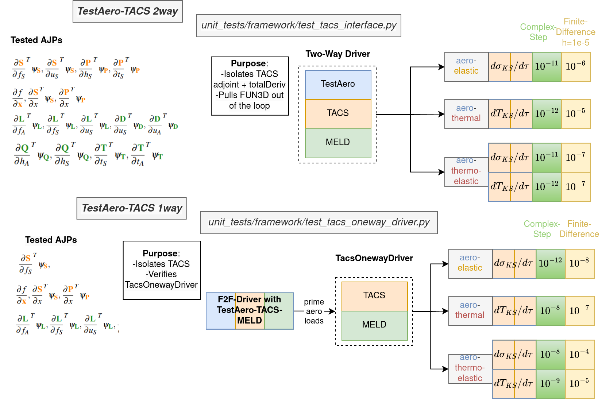

# Steady-State Framework Tests #

Note: the fully-coupled driver here refers to the `FUNtoFEMnlbgs` driver which uses the Nonlinear Block Gauss-Seidel method for driving the coupled residuals to zero.

* `test_composite_with_driver.py` - Test `CompositeFunction` objects with one or multiple scenarios in a fully-coupled driver with TestAero+TACS solvers.
* `test_framework.py` - Test derivatives of the fully-coupled `FUNtoFEMnlbgs` driver using both test solvers - `TestAerodynamicSolver`, `TestStructuralSolver` and all three couplings <i>aeroelastic, aerothermal, aerothermoelastic</i>.
* `test_loads_file.py` - Read and write aerodynamic loads files for the `OnewayStructDriver` which can prime itself from fixed aerodynamic loads.
* `test_multiscenario_framework.py` - Test the derivatives of the fully coupled driver using both test solvers and multiple scenarios.
* `test_multiscenario_tacs.py` - Test the derivatives of a fully-coupled driver with multiple scenarios and TestAero + TACS solvers.
* `test_piston_framework.py` - Test the derivatives of the fully-coupled driver using the `PistonInterface` and TACS solvers.
* `test_sens_file_with_tacs.py` - Write a structural and aerodynamic sens file using the coordinate derivatives following the analysis of a fully-coupled driver with TestAero + TACS solvers.
* `test_sens_file.py` - Write a structural and aerodynamic sens file using the coordinate derivatives following the analysis of a fully-coupled driver with TestAero + TestStruct solvers.
* `test_tacs_const_load.py` - Use the data file `loaded_plate.py` with a constant distributed load to ensure TACS interface derivatives still work with a fixed struct load + coupling loads.
* `test_tacs_interface.py` - Test the structural derivatives of the fully-coupled driver using TACS + TestAero solvers under all three couplings - <i>aeroelastic, aerothermal, aerothermoelastic</i>.
* `test_tacs_oneway_driver.py` - Test the structural derivatives of the `OnewayStructDriver` under each coupling <i>aeroelastic, aerothermal, aerothermoelastic</i>.
* `test_tacs_solver.py` - Test individual adjoint-jacobian products of the TACS structural solver under all three couplings <i>aeroelastic, aerothermal, aerothermoelastic</i>.
* `test_thermConduct_deriv.py` - Test the partial derivative of the thermal conductivity computation $k(t_A)$ which is used in the `Fun3dInterface` for aerothermal+aerothermoelastic couplings to compute the dimensional heat flux.

### TACS Steady-State Derivatives ###
<figure class="image">
  
</figure>