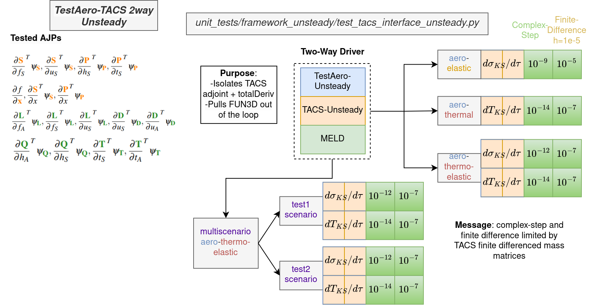
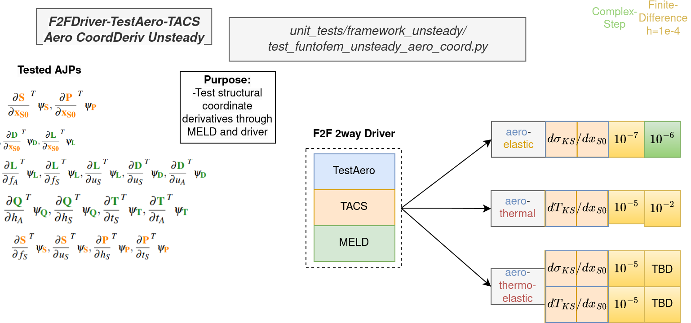
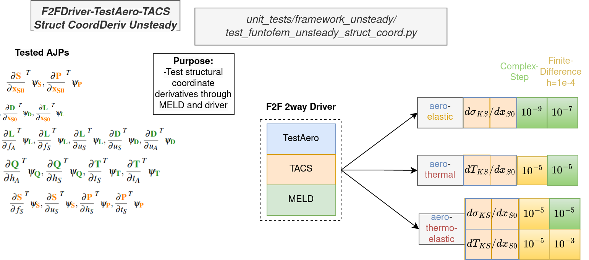

# Unsteady Framework Tests #
* `test_framework_unsteady.py` - Test the fully-coupled unsteady analysis with the TestAero+TestStruct solvers.
* `test_funtofem_unsteady_aero_coord.py` - Test the aerodynamic coordinate derivatives of a fully-coupled unsteady analysis with the TestAero + TACS solvers.
* `test_funtofem_unsteady_struct_coord.py` - Test the structural coordinate derivatives of a fully-coupled unsteady analysis with the TestAero + TACS solvers.
* `test_tacs_driver_unsteady_coordinate.py` - Test the structural coordinate derivatives of a oneway-coupled TACS analysis.
* `test_tacs_interface_unsteady.py` - Test the structural and aerodynamic derivatives of a fully-coupled unsteady analysis with TestAero + TACS solvers.
* `test_tacs_unsteady_shape_driver.py` - Test the structural shape derivatives in ESP/CAPS using the TACS AIM in an unsteady, fully-coupled analysis with TestAero + TACS solvers.

### Unsteady TACS Discipline Derivatives ###
<figure class="image">
  
</figure>

### Unsteady Aerodynamic Coordinate Derivatives ###
<figure class="image">
  
</figure>

### Unsteady Structural Coordinate Derivatives ###
<figure class="image">
  
</figure>