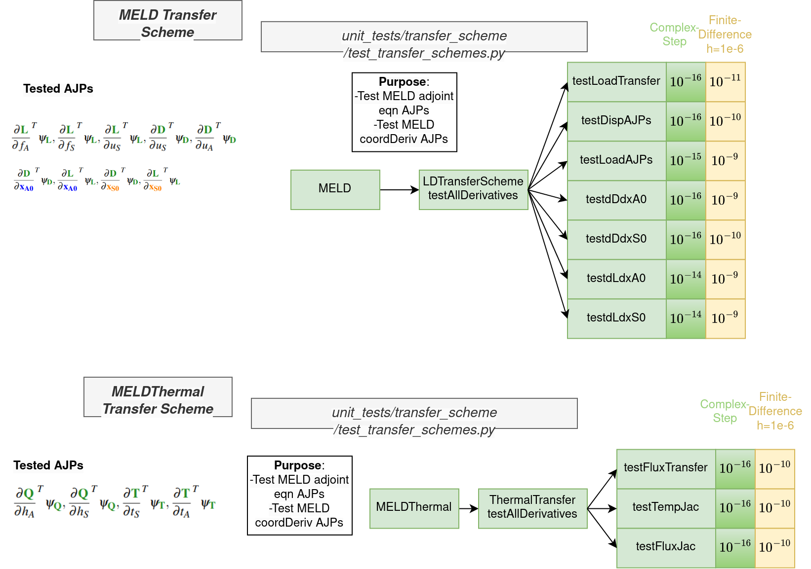

# Transfer Scheme Tests #
Available transfer schemes - MELD, MELDThermal, LinearMELD, RBF, 

* `test_dRduATrans.py` - Test displacement derivatives of a rigid transform matrix in MELD $\partial R/\partial du_A$.
* `test_dRdxA0Trans.py` - Test aero coordinate derivatives of a rigid transform matrix in MELD $\partial R/\partial dx_{A0}$.
* `test_transfer_nonoverlap.py` - Test each transfer scheme using non-overlapping subcommunicators.
* `test_transfer_parallel.py` - Test each transfer scheme using parallel communicators.
* `test_transfer_schemes.py` - Test each transfer scheme using single proc case.

### MELD Derivative Tests ###
All other transfer schemes use the same tests, only MELD is shown here as it's the most commonly used transfer scheme for our applications.
<figure class="image">
  
</figure>